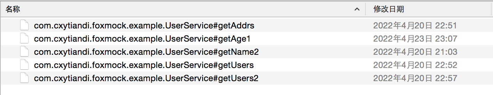

# fox-mock

fox-mock 是基于Java Agent实现的自测，联调Mock利器。能解决你的这些问题：

- 开发过程中，依赖了下游多个接口，想跑个单测都必须得等下游把服务部署好
- 联调过程中，下游某个接口出问题，阻塞了整个流程
- 其他需要Mock方法返回值的场景

优点：无侵入式的Mock解决方案，支持应用启动前挂载和应用启动后attach挂载。

# Quick start

## 下载包
下载fox-mock包，fox-mock 支持在 Linux/Unix/Mac 等平台上一键下载，请复制以下内容，并粘贴到命令行中，敲 回车 执行即可：

```
curl -L http://file.cxytiandi.com/install.sh | sh
```

如果是Windows可以自行通过http://file.cxytiandi.com/foxmock.zip 进行下载，浏览器访问即可。

下载完成后会在当前目录有一个foxmock的文件夹，文件夹里面包含了fox-mock的包。文件夹内容如下：
- fox-mock-agent-${version}.jar  核心代码
- fox-mock-boot-jar-with-dependencies.jar attach启动程序
- agent.properties 配置文件
- start.sh attach启动脚本

## agent启动挂载使用
在服务器上，需要在程序启动参数中添加下面的参数：

```
java -javaagent:fox-mock包的路径/fox-mock-agent-${version}.jar=foxMockFilePath=mock数据文件的路径 -jar 你的jar
```

如果是在开发工具中，也需要将-javaagent加入到启动类的vm options中。

接下来就是要创建mock文件了，mock数据文件格式为方法的全路径，格式为com.xx.xxService#getName

在IDEA中直接选中方法单击右键，选中Copy Reference即可，这个就是mock的文件名。



文件内容就是这个方法要返回的数据，基本类型直接写内容即可。如果是对象需要用json格式。可以参考fox-mock-example中的mockdata文件夹下的示列。


## attach挂载使用

进入到下载好的文件夹中，执行./start.sh，执行之前请确保存在JAVA_HOME的环境变量。

执行之后会提示选择要attach的进程ID, 输入数字按回车即可。然后就完成了mock动作。

attach之前需要将mock的文件路径在agent.properties中指定。